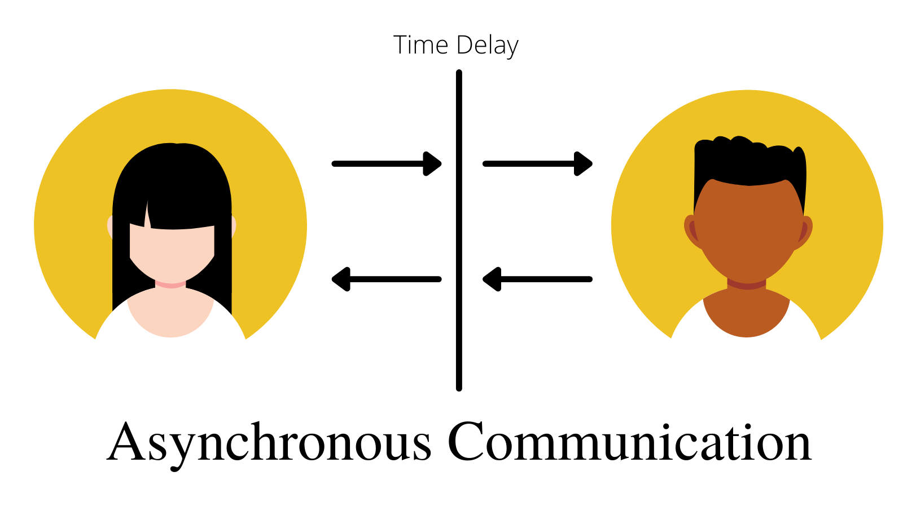

# E-commerce-Micro-Services 👨‍💻🚀🔥🔥

## Welcome! 👋
This project is E-Commerce API depends microservice architecture,
<pre>
MICROSERVICES ARCHITECTURE                                Asynchronous Microservices Communication.    
RabbitMQ                                                  DOCKER
</pre>

<table>
  <tr>
    <td>NODE.JS</td>
    <td>MICROSERVICES ARCHITECTURE  </td>
     <td>Asynchronous Microservices Communication.  </td>
     <td>RabbitMQ</td>
    <td>DOCKER</td>
  </tr>
  <tr>
     <td></td>
    <td></td>
    <td></td>
    <td></td>
    <td></td>
  </tr>
 </table>
 

 <h2 align="center">System Design</h2>

 

 <h2 align="center">DataBase ERD</h2>

 

 ### Built with:

<ul>
<li class="has-line-data" data-line-start="15" data-line-end="16">Restful Api</li>
<li class="has-line-data" data-line-start="16" data-line-end="17">Node.js</li> 
  <li class="has-line-data" data-line-start="16" data-line-end="17">RabbitMQ</li>
<li class="has-line-data" data-line-start="17" data-line-end="18">Express</li>
<li class="has-line-data" data-line-start="18" data-line-end="19">PostgreSQL</li>
<li class="has-line-data" data-line-start="19" data-line-end="20">jsonwebtoken (JWT)</li>
<li class="has-line-data" data-line-start="20" data-line-end="21">nodemailer</li>
<li class="has-line-data" data-line-start="21" data-line-end="22">joi</li>
<li class="has-line-data" data-line-start="21" data-line-end="18">AWS s3</li>
<li class="has-line-data" data-line-start="22" data-line-end="19">AWS EC2</li>
<li class="has-line-data" data-line-start="23" data-line-end="20">Nginx</li>
<li class="has-line-data" data-line-start="24" data-line-end="21">Swagger</li>
<li class="has-line-data" data-line-start="25" data-line-end="22">Docker</li>
</ul>
